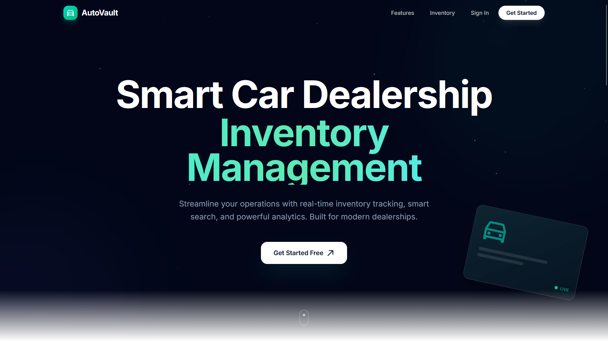
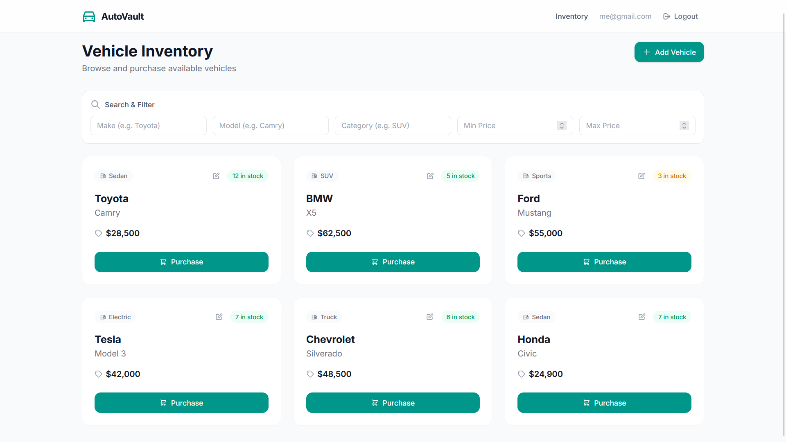
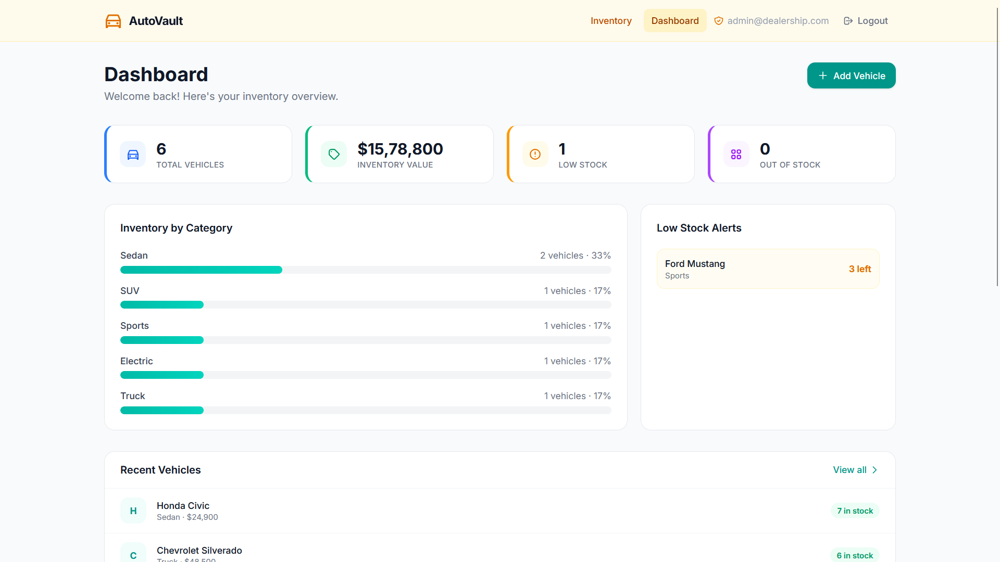
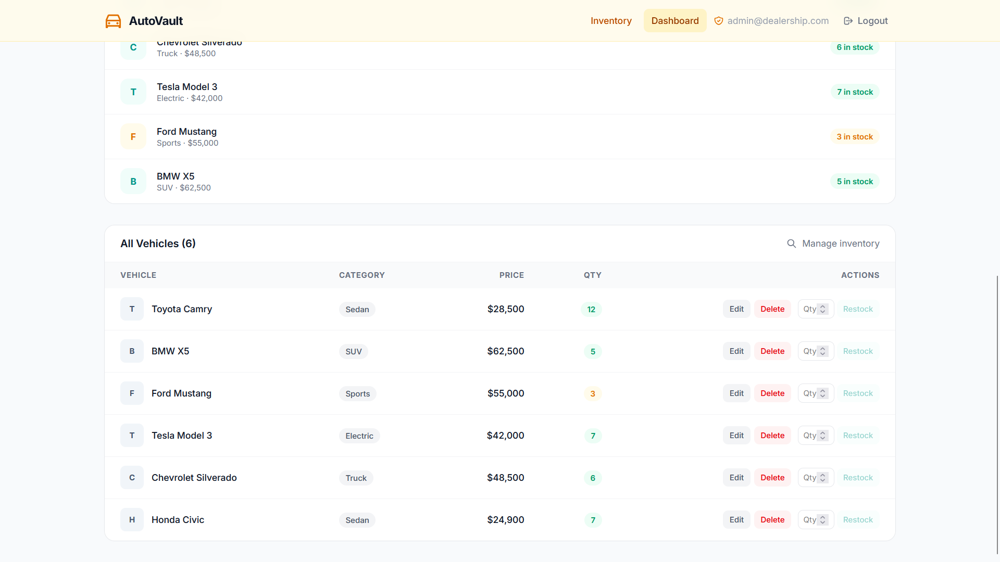
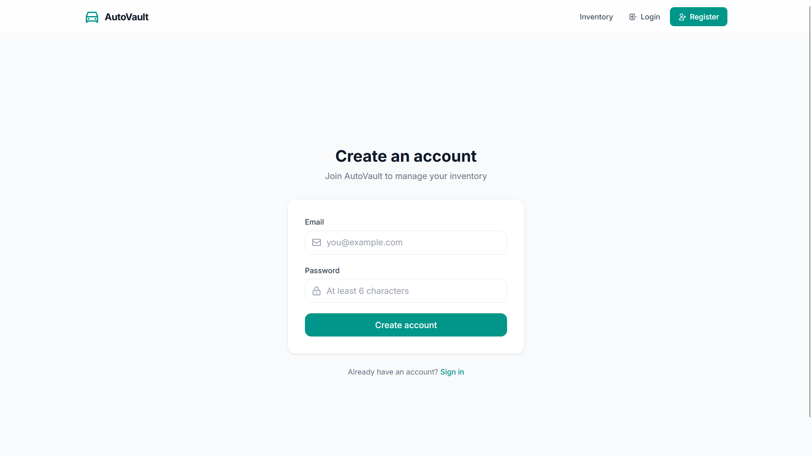

# AutoVault — Car Dealership Inventory System

A full-stack inventory management system for car dealerships. Browse, search, purchase vehicles, and manage inventory with an admin panel.

**Live:** [Frontend (Vercel)](https://car-dealership-inventory-system-sigma.vercel.app/) · [Backend API (Render)](https://car-dealership-inventory-system-arxh.onrender.com)

## Tech Stack

**Backend:** Java 17, Spring Boot 3.3.5, Spring Data JPA, H2 (dev) / PostgreSQL (prod), JWT auth, Maven

**Frontend:** React 19, Vite 8, Tailwind CSS 4, Framer Motion, React Router 7, Axios, React Hot Toast, React Icons

**Testing:** JUnit 5 + Mockito (backend — 65 tests), Vitest + React Testing Library (frontend — 44 tests)

## Getting Started

### Prerequisites

- Java 17+
- Maven 3.8+
- Node.js 18+
- PostgreSQL (for production)

### Backend

```bash
cd backend
mvn spring-boot:run
```

Starts on `http://localhost:8080`.

ADMIN credentials: `admin@dealership.com` / `admin123`

For production, use Docker: `docker build -t autovault . && docker run -p 8080:8080 autovault`

### Frontend

```bash
cd frontend
npm install
npm run dev
```

Starts on `http://localhost:5173` and proxies API calls to the backend.

## Features

- **Public:** Animated landing page with vehicle showcase and brand marquee
- **Authenticated users:** Browse vehicle inventory, search by make/model/category/price range, purchase vehicles
- **Admin users:** Add, edit, delete vehicles; restock inventory; dashboard with stats, charts, and alerts
- **Auth:** JWT-based registration and login with role-based access control

## API Endpoints

| Method | Endpoint | Auth | Description |
|--------|----------|------|-------------|
| POST | `/api/auth/register` | — | Register new user |
| POST | `/api/auth/login` | — | Login, returns JWT |
| GET | `/api/vehicles` | User | List all vehicles |
| GET | `/api/vehicles/search` | User | Search with filters |
| GET | `/api/vehicles/{id}` | User | Get vehicle by ID |
| POST | `/api/vehicles` | Admin | Add vehicle |
| PUT | `/api/vehicles/{id}` | Admin | Update vehicle |
| DELETE | `/api/vehicles/{id}` | Admin | Delete vehicle |
| POST | `/api/vehicles/{id}/purchase` | User | Purchase vehicle |
| POST | `/api/vehicles/{id}/restock` | Admin | Restock vehicle |

## Running Tests

```bash
# Backend (65 tests — 6 DB integration tests require PostgreSQL)
cd backend && mvn test

# Frontend (44 tests)
cd frontend && npm test
```

## Screenshots

### Landing Page


### Vehicle Inventory


### Admin Dashboard


### Admin - Add/Edit Vehicle


### Login & Register


## Project Structure

```
├── backend/
│   ├── src/main/java/com/dealership/inventory/
│   │   ├── config/          # Security, JWT, CORS config + DataSeeder
│   │   ├── controller/      # REST controllers
│   │   ├── dto/             # Request/Response DTOs
│   │   ├── model/           # JPA entities
│   │   ├── exception/       # Global exception handler
│   │   ├── repo/            # Spring Data repositories
│   │   └── service/         # Business logic
│   └── src/test/java/       # 65 tests
└── frontend/
    └── src/
        ├── api/             # Axios instance with JWT interceptor
        ├── components/      # Navbar, SearchBar, VehicleForm, VehicleCard, ProtectedRoute, AdminRoute
        ├── context/         # AuthContext (login, register, logout)
        └── pages/           # LandingPage, HomePage, LoginPage, RegisterPage, AdminPage
```

## My AI Usage

I used AI as a coding assistant throughout this project. Here's a summary of how:

**AI tools used:** opencode with Claude (primary), Gemini, Deepseek, and GLM.

**How I used them:**

- **Planning and architecture:** I described the project requirements and asked the AI to help plan the file structure, API design, and component hierarchy. The AI helped identify the minimal set of components and routes needed.
- **Test-first development:** I followed TDD with the AI writing RED tests first (committing them), then GREEN implementations. The AI was particularly useful for generating comprehensive test cases — it caught edge cases I might have missed, like testing error states, loading states, and role-based access.
- **Backend fixes:** The AI diagnosed the Lombok annotation processor issue (missing `annotationProcessorPaths` in `pom.xml`) that was preventing compilation, and fixed the configuration metadata type mismatch — both bugs I hadn't caught yet.
- **Frontend implementation:** The AI scaffolded the initial React components, wired up routing with React Router, configured Tailwind CSS v4 (which uses a new CSS-based config), and built out the full admin panel with vehicle CRUD operations.
- **Debugging:** When tests failed, the AI quickly identified root causes — like a test expecting inline error text when the component only used toast notifications, or DOM queries returning multiple matching elements — and fixed them with minimal changes.
- **Deployment:** The AI helped set up the Dockerfile, Docker multi-stage build, GitHub Actions CI/CD pipeline, and debugged production issues like JWT secret validation and Hibernate `create-drop` destroying tables on container restart.

**Reflection on AI impact:** AI significantly accelerated my development workflow. Tasks that would have taken hours — like generating 65+ backend test cases, debugging Spring Boot configuration issues, and building a complete React admin panel — were completed in a fraction of the time. The AI was most valuable for boilerplate generation, test coverage, and diagnosing non-obvious configuration errors. However, I made all product decisions myself: what features to build, the UI design (teal/cream color scheme), and the overall architecture. The AI was a tool for execution speed, not decision-making.

## Test Report

| Suite | Tests | Passing | Failing |
|-------|-------|---------|---------|
| Backend | 71 | 65 | 6 (need PostgreSQL) |
| Frontend | 44 | 44 | 0 |
| **Total** | **115** | **109** | **6** |
